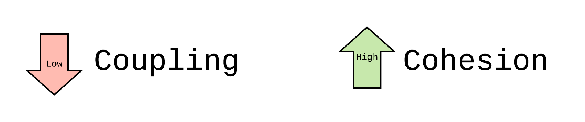

# Object Oriented Programming

[Benefits of OOP](#-Benefits-of-OOP)  
[Building Blocks Of OOP](#-Building-Blocks-Of-OOP)  
[Four Principles of OOP](#Four-Principles-of-OOP)  
[Interview QA](#-Interview-QA)

## [Check this](https://www.educative.io/blog/object-oriented-programming#four)

> Object Oriented programming (OOP) is a programming paradigm that relies on the concept of classes and objects. It is used to structure a software program into simple, reusable pieces of code blueprints (usually called classes), which are used to create individual instances of objects.

**Classes**: an abstract blueprint used to create specific, concrete **objects**.
* Attributes
* Methods (functions)

## Benefits of OOP
1. OOP models complex things as reproducible, simple structures

2. Reusable, OOP objects can be used across programs

3. Allows for class-specific behavior through **polymorphism**

4. Easier to debug, classes often contain all applicable information to them

5. Secure, protects information through encapsulation


## Building Blocks Of OOP
classes, objects, methods, attributes

### Classes
> In a nutshell, classes are essentially user defined data types.  

A template for modeling.

### Objects
> Objects are instances of classes created with specific data

### Attributes
> Attributes are the information that is stored. Attributes are defined in the Class template.

### Methods
> Methods represent **behaviors**. Methods perform **actions**; methods might return information about an object, or update an object’s data.

## Four Principles of OOP

Inheritance, Encapsulation, Abstraction, Polymorphism

### Inheritance
> Inheritance allows classes to inherit features of other classes. 

Child classes inherit from parent classes.

### Encapsulation
> Encapsulation means containing all important information inside an object, and only exposing selected information to the outside world

Encapsulation adds security.

* Python has no private attribute or variable like c++, JAVA. It is possiable access variables from outside. Now use `__` prifix to make a statement. Check [this answer](https://stackoverflow.com/questions/1641219/does-python-have-private-variables-in-classes) for detail.

**Benefits** for encapsulation:
- add security
- protect against common mistakes, developers don't accidentally change important data
- protect IP, only public methods are accessible for outside developer
- Hide complexity

### Abstraction
> user interacts with only selected attributes and methods of an object. Abstraction uses simplified, high level tools, to access a complex object

**Benefits**:
* Simple, high level user interfaces
* Complex code is hidden
* Security
* Easier software maintenance

### Polymorphism
> designing objects to share behaviors

> Polymorphism allows the **same method** to execute different behaviors in two ways: method overriding and method overloading.

**Method Overriding**:

A child class can provide a different implementation than its parent class.

**Method Overloading**:

> Methods or functions may have the same name, but a different number of parameters passed into the method call

**Disadvantages** : 
> Disadvantages: Polymorphism reduces the readability of the program and runtime polymorphism can lead to the performance issue as machine needs to decide which method or variable to invoke

## Interview QA
1. Compostion and Inheritance. Check [this link](https://www.geeksforgeeks.org/inheritance-and-composition-in-python/) for code detail in python.

    ```
    class Component:
    
    # composite class constructor
        def __init__(self):
            print('Component class object created...')
    
        # composite class instance method
        def m1(self):
            print('Component class m1() method executed...')
    class Composite:
    
        # composite class constructor
        def __init__(self):
    
            # creating object of component class
            self.obj1 = Component()
            
            print('Composite class object also created...')
    
        # composite class instance method
        def m2(self):
            
            print('Composite class m2() method executed...')
    
            # calling m1() method of component class
            self.obj1.m1()
    
    
    # creating object of composite class
    obj2 = Composite()
    
    # calling m2() method of composite class
    obj2.m2()
    ```

    > Inheritance is an "is-a" relationship. Composition is a "has-a" relationship.Composition and Inheritance both provide code reusability by relating class.Inheritance derives one class from another one class, composition can have an instance of another class as a field.

2. Dependency injection (DI)
    > Dependency Injection is a technique where an object receives other objects that it depends on.
DI is a design pattern used to implement IoC. By DI, the responsibility of creating objects is shifted from our application code to the Spring container; this phenomenon is called Inversion of Control (IoC). The injection can be constructor injection(recommended) or setter injection or field injection.
Advantages: Dependency injection makes testing easier and DI is an approach to implement loose coupling among the classes in an application.
Disadvantages: Code is difficult to trace and read in Dependency Injection, it increases complexity in the linkages between classes.

| |
| - |


Now see [this page](https://python-dependency-injector.ets-labs.org/introduction/di_in_python.html) for detail of DI.


3. The five principles concept:  
SOLID

4. add new class to a collection framework, what document do you add?  
    - modify metadata?
    - ordered return type?
    - the range of input
    - thread safe?
    - time/space complexity


5. 一个数据结构，你觉得documentation里头要写啥比较好  
    - @author（只出现在类和接口的文档中）
    - @version（只出现在类和接口的文档中）
    - @param（只出现在方法或构造器的文档中）
    - @return（只出现在方法中）
    - @exception（从java1.2之后也可以使用@thrown替代）
    - @see
    - @since
    - @deprecated
    - more examples


6. What is Static Binding and Dynamic Binding?  
    See [this answer](https://stackoverflow.com/questions/9837972/static-type-binding-vs-dynamic-type-binding) also.  
    **Static Binding**:  
        Static Binding is a binding in which name can be as‍‍‍‍‍‍‌‍‍‍‍‌‌‍‌‌‍‌‌sociated with the class during compilation time, and it is also called as early Binding.

    **Dynamic Binding**:  
        Dynamic Binding is a binding in which name can be associated with the class during execution time, and it is also called as Late Binding.

7. When would you use composition and inheritance over the other, what are some of the tradeoffs?

    > Does TypeB want to expose the complete interface (all public methods no less) of TypeA such that TypeB can be used where TypeA is expected? Indicates Inheritance. "is-a" relationship
Does TypeB want only some/part of the behavior exposed by TypeA? Indicates need for Composition. "has-a" relationship
