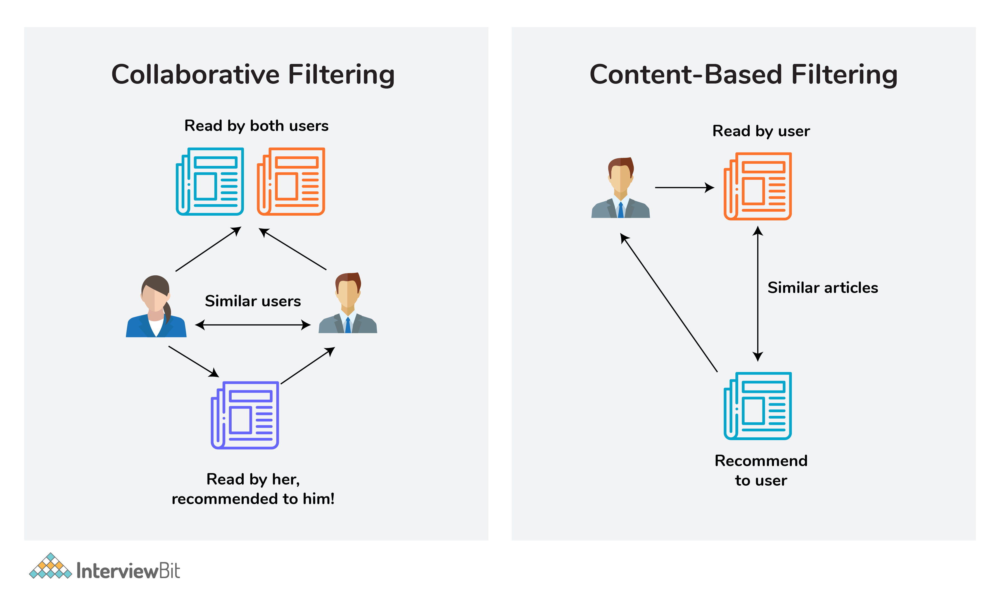

# Machine Learning
[This page](https://www.interviewbit.com/machine-learning-interview-questions/) introduces machine learning interview questions.

- [Machine Learning](#machine-learning)
  - [Unsupervised Learning](#unsupervised-learning)
    - [types](#types)
    - [methods](#methods)
  - [Interview questions](#interview-questions)
    - [MLE and MAP](#mle-and-map)
    - [Naieve Bayes](#naieve-bayes)
    - [PCA and SVD](#pca-and-svd)
    - [SVM](#svm)
    - [K-fold cross validation](#k-fold-cross-validation)
    - [Classification and Regression](#classification-and-regression)
    - [Precision, Recall, F1, etc](#precision-recall-f1-etc)
    - [Overfitting and Underfitting](#overfitting-and-underfitting)
    - [Ensemble learning](#ensemble-learning)
    - [Random forest](#random-forest)
    - [Collabotive filtering and Content-based filtering](#collabotive-filtering-and-content-based-filtering)
    - [Clustering](#clustering)

> Machine Learning refers to the process of **training** a computer program to build a statistical model based on data. The goal of machine learning (ML) is to turn data and identify the key patterns out of data or to get key insights.

## Unsupervised Learning 
A type of maching learning algorithm used to find pattern, in this, no variable or labels to predict. 

### types
* Clustering
* Anomaly Detection
* NN models and latent Variable Models

### methods 
* PCA
* K-meams clustering

## Interview questions
### MLE and MAP
Maximum Likelihood Estimation and Maximum A Posterior.  
Please take a look at [this answer](https://zhuanlan.zhihu.com/p/32480810) for detail. 

### Naieve Bayes
take a look at [this blog](https://zhuanlan.zhihu.com/p/26262151)
- iid

### PCA and SVD
please see [this answer](https://www.cnblogs.com/bjwu/p/9280492.html) for detail  
Principal Component Analysis (PCA), is EVD of covariance matrix $C=\frac{1}{m}XX^{T}$  
Singular Value Decomposition (SVD), is EVD of $A^{T}A$

### SVM
Support vector machine (SVM)
> In data classification problems, SVM can be used to it provides the maximum separating margin for a linearly separable dataset. That is, of all possible decision boundaries that could be chosen to separate the dataset for classification, it chooses the decision boundary which is the most distant from the points nearest to the said decision boundary from both classes.

**Kernel** functions, see [this link](https://medium.com/@zxr.nju/what-is-the-kernel-trick-why-is-it-important-98a98db0961d) for more info:
* Linear kernel
* Polynomial kernel
* Radial basis kernel, Gaussian Kernel
* Sigmoid kernel

**Support Vectors**: The Support Vectors are the points at the edge of the dividing hyperplane.

### K-fold cross validation

### Classification and Regression
- classification: discrete results
- regression: continous data

### Precision, Recall, F1, etc

Precision: $TP / TP+FP$  
Recall: $TP / TP+FN$  
f-1: $(2*precision*recall) / (precision+recall)$, how well a model retrieves relevant results and the model is performing.

### Overfitting and Underfitting
**Underfitting**:  
- more data
- change algorithms
- deeper the network

**Overfitting**:  
Happens: 
- small dataset
- too noisy
- complicated model

Solutions:  
- reduce network's capacity
- regularization
  - L1 regularization: absolute value of the parameters -> some weights to be 0
  - L2 regularization: squared value of the parameters -> smaller weights
- dropout layers

### Ensemble learning
combining multiple machine learning models to create more powerful model

**Bagging and Boosting**: see [bagging and boosting](https://easyaitech.medium.com/%E4%B8%80%E6%96%87%E7%9C%8B%E6%87%82%E9%9B%86%E6%88%90%E5%AD%A6%E4%B9%A0-%E8%AF%A6%E8%A7%A3-bagging-boosting-%E4%BB%A5%E5%8F%8A%E4%BB%96%E4%BB%AC%E7%9A%84-4-%E7%82%B9%E5%8C%BA%E5%88%AB-6e3c72df05b8) for detail. 

### Random forest
see [random forest](https://easyai.tech/ai-definition/random-forest/) for detail

### Collabotive filtering and Content-based filtering
||
| - |
||

Collabotive filtering:  
> Collaborative filtering is a type of recommendation system that predicts new content by matching the interests of the individual user with the preferences of many users.

Content-based filtering:  
> Content-based recommender systems are focused only on the preferences of the user. New recommendations are made to the user from similar content according to the user’s previous choices.

### Clustering
> Clustering is the process of grouping a set of objects into a number of groups. Objects should be similar to one another within the same cluster and dissimilar to those in other clusters.

Clustering Methods: 
- Hierarchical clustering
- K-means
  - elbow method to choose the best **K**
- Density-based clustering, etc
